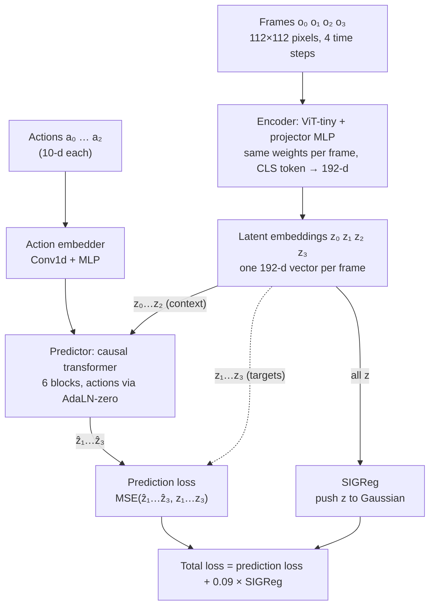
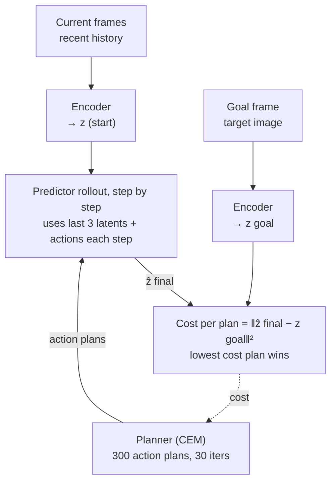

# JEPA model

This repo trains a JEPA world model. The model learns to predict the next state as a latent vector, not as pixels. Then a planner uses the model to find actions that reach a goal image.

Code: [`jepa.py`](../jepa.py), [`module.py`](../module.py), [`train.py`](../train.py).
Config: [`config/train/lewm.yaml`](../config/train/lewm.yaml), [`config/train/model/lewm.yaml`](../config/train/model/lewm.yaml).

## Training

- Each sample has 4 frames: `history_size` 3 plus `num_preds` 1.
- The encoder ([`jepa.py:31`](../jepa.py#L31)) is a ViT-tiny. It uses patch size 14 on 112×112 images. It takes the CLS token, and a projector MLP then makes a 192-d vector `z` for each frame. All frames use the same encoder weights.
- One action is 5 raw actions stacked together (`frameskip` 5 × 2-d action for PushT = 10-d). The `Embedder` ([`module.py:196`](../module.py#L196)) changes it to 192-d.
- The predictor (`ARPredictor`, [`module.py:251`](../module.py#L251)) is a causal transformer. It gets z₀…z₂. It adds the actions to each block through AdaLN-zero, which means the action embedding sets the scale, shift and gate of each block. At position t, it predicts z₍t+1₎. A `pred_proj` MLP comes after it.
- The dashed line shows the targets z₁…z₃. They come from the same encoder.
- The loss is computed in `lejepa_forward` ([`train.py:23`](../train.py#L23)).

### How the model does not collapse

There is no stop-gradient and no EMA target encoder. The gradient goes into the targets too. A model like this can collapse: it can map every image to the same `z`, and then the prediction loss is 0. Usual JEPA models stop this with an EMA teacher.

This repo uses `SIGReg` ([`module.py:11`](../module.py#L11)) instead. SIGReg projects `z` onto 1024 random directions. It then gives a penalty if the values in a direction do not look like a standard Gaussian (Epps-Pulley test). If `z` collapses, the values are not Gaussian, so the penalty becomes large.

The loss weight is 0.09 (`loss.sigreg.weight` in [`config/train/lewm.yaml`](../config/train/lewm.yaml)).

## Planning

- At eval time, the model encodes the current frames and the goal image (`get_cost`, [`jepa.py:135`](../jepa.py#L135)).
- The CEM solver samples 300 action plans. `rollout` ([`jepa.py:63`](../jepa.py#L63)) runs the predictor step by step in latent space. Each step uses only the last 3 latents.
- The cost of a plan is the squared distance between the last predicted latent and the goal latent (`criterion`, [`jepa.py:119`](../jepa.py#L119)).
- The dashed line shows this cost going back to the solver. The solver then refines its plans, for 30 iterations. The model never makes pixels.
