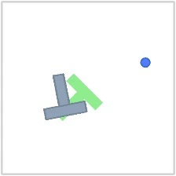

# Understanding the PushT dataset

This guide explains the contents of `pusht_expert_train.lance` (HF: `librakevin/lewm-pusht`). To browse it in a web UI, see [viewing_lance_datasets.md](viewing_lance_datasets.md).

The dataset is a flat table: **each row is one timestep of one PushT demonstration**.

## The task

PushT is a 2D pushing task:

*`pixels` of episode 0, step 0.*

- **Blue circle**: the agent (the "pusher" you control).
- **Grey T**: the block to be pushed.
- **Green T**: the goal pose, fixed and drawn on the floor.

The goal is to push the grey T until it covers the green one. `expert` means these are expert (scripted or skilled) demonstrations, used as training data.

## Size

- **2,336,736 rows** (timesteps).
- **18,685 episodes**, 49 to 246 steps each (about 125 on average).

## Columns

| Column | Shape | Meaning |
|---|---|---|
| `episode_idx` | int32 | Which demonstration the row belongs to (0 to 18684) |
| `step_idx` | int32 | Timestep within that episode (0 to 245) |
| `pixels` | JPEG bytes | 224×224 RGB render of the scene at this step; the model's visual input |
| `action` | 2 × float32 | 2-D command sent to the agent at this step, roughly in the range −1.5 to 2. A normalized, relative move command, not an absolute position |
| `proprio` | 4 × float32 | The agent's own body state: `[agent_x, agent_y, agent_vx, agent_vy]`, in pixel units of a 512×512 world |
| `state` | 7 × float32 | Full simulator state: `[agent_x, agent_y, block_x, block_y, block_angle, agent_vx, agent_vy]`. The angle is in radians (0 to 2π) |

Things to notice:

- `proprio` is a subset of `state` (agent position and velocity). `state` adds the T's position and angle, which is the privileged information the model has to infer from pixels.
- In the first rows of episode 0, the block values (`192.67, 335.16, 2.95`) stay constant while the agent moves: the agent hasn't reached the T yet.
- At `step_idx=0` the velocity is `0, 0`; every episode starts at rest.

Example (first three rows of episode 0):

| step | action | proprio | state |
|---|---|---|---|
| 0 | `[0.14, -0.25]` | `[423.0, 182.0, 0.0, 0.0]` | `[423.0, 182.0, 192.67, 335.16, 2.95, 0.0, 0.0]` |
| 1 | `[0.06, -0.09]` | `[427.14, 174.61, 52.38, -93.54]` | `[427.14, 174.61, 192.67, 335.16, 2.95, 52.38, -93.54]` |
| 2 | `[-0.02, 0.04]` | `[430.44, 169.26, 21.58, -31.59]` | `[430.44, 169.26, 192.67, 335.16, 2.95, 21.58, -31.59]` |

## Reading it in the viewer

- Filter or sort by `episode_idx` and scroll through `step_idx` in order to replay one demonstration.
- Compare `pixels` with `state`: the blue dot's position should match `state[0:2]`, and the grey T should match `state[2:5]`.

## How training uses it

[config/train/data/pusht.yaml](../config/train/data/pusht.yaml) configures the loader. Training doesn't read single rows. It slices windows of `history_size + num_preds` consecutive steps from one episode, subsampled with `frameskip: 5`. It loads `pixels`, `action`, `proprio` and `state`, and caches everything except `pixels` in memory. The JEPA world model learns: given past frames and actions, predict the embedding of future frames.
