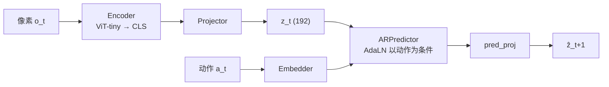

# World Model 讲解

定义 · 核心难题 · 技术路线 · 评测 · 可解释性 · LeWorldModel

<div class="pt-10 opacity-80 text-sm">
截至 2026 年 9 月底 · 基于一篇中文综述，并参考其他公开综述
</div>

<!--
这套 slides 的主线来自一篇中文综述《World Model 研究综述（截至 2026 年 9 月底）》，
Part 1.5 和各页脚注补充了其他公开综述的视角，Part 4 联系本仓库的 LeWM 代码。
-->

---

# 一句话结论

<div class="text-xl leading-10 mt-8">

"world model" 已分化为两条严格意义上的路线：

- **生成式交互世界模型**：Genie 3、Dreamer 4、Waymo World Model
- **潜空间 / JEPA 世界模型**：V-JEPA 2-AC、LeWorldModel

两条路线的配方正在汇合：**海量被动视频预训练 + 少量动作数据学动作效应 + 在表征空间做预测**。

</div>

<div class="mt-8 p-4 rounded bg-amber-500/15 border-l-4 border-amber-500">
最核心的问题仍未解决：模型学到的是<b>可外推的因果动力学</b>，还是<b>高保真的模式插值</b>？
</div>

---

# TL;DR

<div class="grid grid-cols-3 gap-6 mt-6 text-sm">
<div class="p-4 rounded bg-sky-500/10">

### 定义与格局

严格意义上要满足三个条件：以动作为条件、干预下预测正确、闭环长时一致。

Sora 类视频生成器、Marble 类 3D 生成器、Cosmos 类平台**都不算世界模型本身**。

</div>
<div class="p-4 rounded bg-rose-500/10">

### 核心难题

1. OOD 物理泛化失败
2. 闭环误差累积、长时记忆
3. 评测碎片化
4. 动作标注稀缺
5. JEPA 表征坍缩（已大幅缓解）
6. 来自 VLA 的正面竞争

</div>
<div class="p-4 rounded bg-emerald-500/10">

### 可解释性切入点

"世界模型内部是否存在**可因果干预的物理状态变量**？"

现有工作几乎都停在 probing 层面；把 SAE、activation patching、causal abstraction 搬到动作条件世界模型上，是明确的空白。

</div>
</div>

---
layout: section
title: Part 1 · 定义与分类
---

# Part 1
定义与分类

---

# 严格意义上的世界模型：三个条件

<div class="grid grid-cols-3 gap-6 mt-10">
<div class="p-5 rounded bg-sky-500/10 text-center">
<div class="text-4xl mb-3">🎮</div>

**以动作为条件**

预测"如果我这么做，会怎样"，而不只是"接下来会怎样"

</div>
<div class="p-5 rounded bg-sky-500/10 text-center">
<div class="text-4xl mb-3">🔧</div>

**干预下预测正确**

换一个动作，预测也要跟着正确地变

</div>
<div class="p-5 rounded bg-sky-500/10 text-center">
<div class="text-4xl mb-3">🔁</div>

**闭环 rollout 长时一致**

把自己的预测喂回去，长时间不崩

</div>
</div>

<div class="mt-10 text-center opacity-80">
按这个标准：只有<b>生成式交互模型</b>（Genie / Dreamer / GAIA / Matrix-Game）和 <b>latent / JEPA 模型</b>两派符合。
</div>

---

# 两种形式化

<div class="grid grid-cols-2 gap-8 mt-4">
<div>

### RL / POMDP（Dreamer 系）

$$
\begin{aligned}
&\text{转移：} && p(s_{t+1}\mid s_t, a_t) \\
&\text{观测：} && p(o_t\mid s_t) \\
&\text{奖励：} && p(r_t\mid s_t)
\end{aligned}
$$

- 概率模型，状态与观测分开
- 预测与奖励耦合
- PlaNet → DreamerV1–V3 → Dreamer 4

</div>
<div>

### LeCun JEPA（2022）

$$
\begin{aligned}
h_t &= \mathrm{Enc}(x_t) \\
s_{t+1} &= \mathrm{Pred}(h_t, s_t, z_t, a_t)
\end{aligned}
$$

- 没有奖励模型，代价放在其他模块
- 预测器确定性，不确定性只经由潜变量 $z_t$ 进入
- 在**表征空间**预测，默认不解码回像素

</div>
</div>

<div class="mt-6 p-3 rounded bg-amber-500/15 text-center">
根本分歧不在公司之间，而在：<b>预测像素（或 token）</b>，还是<b>预测表征</b>？
</div>

---
class: text-xs
---

# 被冠以 "world model" 标签的几类东西

| 类别 | 预测空间 | 以动作为条件？ | 代表 | 严格意义上算吗 |
|---|---|---|---|---|
| 视频生成器 | 像素 | 否（只有 prompt） | Sora、Veo 3、Kling、Seedance | 否；可作强先验 / 初始化 |
| 3D / 空间生成器 | 3D 场景（3DGS / mesh） | 否或弱 | World Labs Marble / Atlas、HY-World 2.0 | 否（有空间持久性，无时间动力学） |
| **生成式交互世界模型** | 像素 / latent token | **是** | Genie 3、Dreamer 4、GAIA-2、Waymo WM、Matrix-Game 3.0 | **是** |
| **Latent / JEPA 世界模型** | embedding | **是** | V-JEPA 2-AC、DINO-WM、LeWorldModel | **是** |
| 基础设施平台 | 混合 | 部分 | NVIDIA Cosmos | 平台，不是单一模型 |
| 主动推断 | 结构化生成模型 | 是 | VERSES AXIOM | 是，但可扩展性未验证 |

<div class="mt-4 p-3 rounded bg-slate-500/10 italic">
"In six months, every company will call itself a world model to raise funding." —— AMI Labs CEO Alexandre LeBrun（2026-03，TechCrunch）
</div>

---

# 可解释性意义上的 "world model"

问题：一个只做序列预测的网络，内部是否表征了生成数据的**底层状态**？


- **Othello-GPT**（Li et al., 2210.13382）：只用走子序列训练，内部能探测出棋盘状态，且能干预；后续发现它在"己方 / 对方"坐标系下是线性的
- **Vafa et al. 2024**（2406.03689）：用 Myhill-Nerode 边界检验——纽约出租车路线上 next-token 准确率很高，但隐含"地图"不连贯
- **Vafa et al. 2025**（ICML）：行星轨道上训练的 transformer 能准确预测轨迹，但迁移到新任务时，隐含"力学定律"和牛顿引力不一致


<div class="mt-8 p-4 rounded bg-amber-500/15 text-center text-lg">
方法论教训：<b>预测准确 ≠ 拥有世界模型</b>，必须用<b>干预</b>和<b>迁移</b>来检验
</div>

---
class: text-xs
---

# 如何验证模型学到了动作条件动力学

<div class="text-sm -mt-2 mb-3">

动作条件动力学 = $p(s_{t+1}\mid s_t, a_t)$："我做了这个动作，世界会怎么变"。在 3D 场景里移动相机只是换视角，世界本身没变；推杯子、开门才是改变世界。

</div>

<div class="grid grid-cols-3 gap-3">
<div class="p-3 rounded bg-sky-500/10">

**① 对动作敏感吗**
把动作换成随机的或去掉：预测几乎不变 → 模型没用动作，只在"猜剧情"。"什么都不做"时，静止的东西应保持静止

</div>
<div class="p-3 rounded bg-sky-500/10">

**② 反事实对比**
同一起点，"左推" vs "右推"：方向相反、幅度合理；有模拟器时和真实物理逐步对比误差

</div>
<div class="p-3 rounded bg-sky-500/10">

**③ 内部一致性**
可逆（左 5 再右 5 回原处）· 可组合（两个小动作 = 一个大动作）· 守恒（东西不凭空消失）

</div>
<div class="p-3 rounded bg-emerald-500/10">

**④ 动作可反推**
用真实数据训练的逆动力学模型去看预测的前后两帧，反推出的动作应与输入一致

</div>
<div class="p-3 rounded bg-emerald-500/10">

**⑤ 拿来做决策**
用模型规划、在真实环境执行，看任务能否完成（本仓库 notebook 09 的 PushT 评估）；更严格：模型里的策略排序应与真实一致（WorldGym）

</div>
<div class="p-3 rounded bg-emerald-500/10">

**⑥ 分布外测试**
没见过的动作幅度、物体组合、更长时间跨度（Kang et al.）。分布内准只说明记住或插值

</div>
</div>

<div class="mt-3 p-3 rounded bg-amber-500/15">

**⑦ 往模型内部看**：探测（能否读出位置、速度、接触）只说明信息**存在**；直接改内部表征、看预测是否跟着变（干预），才说明模型在**使用**它。

</div>

<!--
这一页和下一页不是来自原综述，是讨论中补充的整理。
-->

---
class: text-xs
---

# 人和机器学到的动力学可以不一样吗？

<div class="grid grid-cols-2 gap-5 mt-2">
<div class="p-4 rounded bg-emerald-500/10">

**✅ 不同但等价：没问题**

- **Othello-GPT**：人用"黑/白"记棋盘，模型用"我方/对方"——可以一一换算，同样有效
- **可辨识性理论**（Klindt et al.）：LeJEPA 学到的是"线性变换意义下"的真实潜变量——内部坐标可能是位置和速度的混合，能换算回去就对
- **只学有用的部分**：MuZero 不预测画面，只预测与奖励 / 价值相关的东西（"价值等价"）
- 人类直觉物理本身也不精确（McCloskey 1980），但日常够用——**人类不是标准答案**

</div>
<div class="p-4 rounded bg-rose-500/10">

**❌ 只在训练数据上碰巧一致：有问题**

- **Vafa et al. 2025**：行星轨道预测很准，隐含的"力学定律"却不是牛顿引力，换个任务就出错
- **Kang et al.**：case-based 泛化——找最像的训练样本来模仿，分布内完美、分布外失败
- 这不是"另一种正确的物理"，而是一个只在见过的数据上和真实物理**重合**的函数

</div>
</div>

<div class="mt-4 p-4 rounded bg-amber-500/15">

**标准不是"和人一样"，而是"在关心的干预范围内预测都正确"**（Vafa 的 Myhill-Nerode 思路：对所有后续给出同样预测的两个模型就是等价的）。

怎么区分：① **扩大干预范围**——等价的模型换到新动作、新任务仍然正确；② **找换算关系**（causal abstraction）——找不到不一定错，可能是人没想到的变量，仍需回到 ①；③ **说清有效范围**——"PushT 上够用" ≠ "学会了二维刚体物理"。

</div>

---
layout: section
title: Part 1.5 · 其他综述怎么看 world model
---

# Part 1.5
其他综述怎么看 world model

<div class="text-sm opacity-70 mt-4">
Ding et al. · Li et al. · Oh · Zidan et al. · Hou et al. · Wang et al. · Kong et al. · AbdelStark
</div>

---
class: text-sm
---

# 定义：共识与分歧

<div class="grid grid-cols-2 gap-6">
<div>

**Wang et al.（机器人操作，2606.00113）操作性定义三要素**

1. **Predictive**：估计未来，不只编码当下（静态编码器、检测器不算）
2. **World-grounded**：描述外部世界（物体、几何、接触……）；reward / value 本身不算
3. **Intervention-aware**：能预测或评估机器人干预下的演化

**Kong et al.（3D/4D，2509.07996）划清四个概念**

- 3D/4D **生成**：只看保真度和多样性
- 3D/4D **world modeling**：由过去观测和动作预测未来（不一定在观测空间）
- **场景模拟**：闭环、由动作驱动的交互 rollout
- **World model**：以动作为条件的内部预测模型

</div>
<div>

**Zidan et al.（2606.00133）**：至今**没有公认的定义**——FVD 好的视频模型也叫 world model，而有些真正做动作条件预测的模型反而不这么叫

<div class="mt-6 p-4 rounded bg-emerald-500/10">

**对照本综述的"严格三条件"**

大家的交集是：**预测未来** + **以动作 / 干预为条件**。

Kong：只合成像素的生成器"本身不是世界模型"；观测空间重建是充分条件，但不是必要条件——正好对应"预测表征"这一派。

</div>
</div>
</div>

---

# Ding et al.：理解世界 vs 预测未来

<div class="text-xs opacity-60 -mt-2 mb-4">Understanding World or Predicting Future? A Comprehensive Survey of World Models（2411.14499，ACM CSUR 2025，清华）</div>

<div class="grid grid-cols-2 gap-6">
<div class="p-4 rounded bg-sky-500/10">

### ① 隐式表征：理解世界

- 把外部现实转成 latent 变量，支持决策
- 决策中的世界模型（MBRL）
- LLM / MLLM 学到的世界知识

</div>
<div class="p-4 rounded bg-rose-500/10">

### ② 预测未来：模拟世界

- 世界模型即视频生成
- 世界模型即具身环境

</div>
</div>

<div class="grid grid-cols-2 gap-6 mt-5 text-sm">
<div>

**两种部署角色**

- **云端环境**：数据引擎（给 VLA / VLN 造数据）、RL 环境、策略评估器
- **端侧智能体大脑**：嵌在智能体里做决策

</div>
<div>

**四个应用域**：游戏智能 · 具身智能 · 城市智能 · 社会智能

**开放问题**：物理规则与反事实模拟、社会维度、基准、sim-to-real、模拟效率、伦理与安全

</div>
</div>

---

# Oh：显式 vs 隐式世界模型

<div class="text-xs opacity-60 -mt-2 mb-2">A Tutorial on World Models and Physical AI（2606.12783）</div>

<div class="grid grid-cols-2 gap-6 mt-2">
<div class="p-4 rounded bg-sky-500/10">
<div class="text-lg font-bold">显式世界模型</div>
<div class="text-sm opacity-80 mb-3">有可以直接查询的转移模型 → rollout、规划、反事实</div>
<div class="grid grid-cols-3 gap-2 text-sm text-center">
<div class="p-2 rounded bg-sky-500/20">无记忆型<br/><span class="text-xs">Ha & Schmidhuber</span></div>
<div class="p-2 rounded bg-sky-500/20">上下文型<br/><span class="text-xs">Dreamer</span></div>
<div class="p-2 rounded bg-sky-500/20">规划型<br/><span class="text-xs">MuZero + MCTS</span></div>
</div>
</div>
<div class="p-4 rounded bg-rose-500/10">
<div class="text-lg font-bold">隐式世界模型</div>
<div class="text-sm opacity-80 mb-3">知识编码在表征几何里，不暴露独立的动力学函数</div>
<div class="grid grid-cols-3 gap-2 text-sm text-center">
<div class="p-2 rounded bg-rose-500/20">语言模型<br/><span class="text-xs">LLM / VLM</span></div>
<div class="p-2 rounded bg-rose-500/20">生成式视频<br/><span class="text-xs">Genie</span></div>
<div class="p-2 rounded bg-rose-500/20">不生成<br/><span class="text-xs">JEPA</span></div>
</div>
</div>
</div>

<div class="text-sm mt-2">

**设计空间四轴**：状态表示（显式变量 / 学到的 latent）· 动力学（确定 / 随机，怎么处理不确定性）· 使用方式（想象 rollout 规划 / 预测表征塑造策略）· 训练目标（重建、奖励预测、自监督）

**通往 AGI 的方向**：把显式和隐式世界建模统一起来

</div>

---
class: text-sm
---

# Li et al.：三轴分类

<div class="text-xs opacity-60 -mt-2 mb-4">A Comprehensive Survey on World Models for Embodied AI（2510.16732）</div>

| 轴 | 取值 | 代表 |
|---|---|---|
| **功能** | 决策耦合（为具体决策服务）<br/>通用（任务无关的动力学预训练） | Ha & Schmidhuber、PlaNet / RSSM、Dreamer 系列<br/>iVideoGPT、Genie、RoboScape、DINO-world |
| **时间建模** | 逐步模拟与推断（自回归）<br/>全局差分预测（一次预测多步） | RNN / RSSM、自回归 token 模型<br/>扩散类整段生成 |
| **空间表征** | 全局 latent 向量 · token 序列 · 空间 latent 网格 · 分解渲染表征（如 3DGS / NeRF） | Dreamer · Genie · BEV / occupancy · 3D 场景模型 |

<div class="mt-6 p-4 rounded bg-amber-500/15">

**核心张力**：自回归设计紧凑、样本效率高，但**误差累积**；全局预测多步更一致，但计算重、**闭环交互性弱**。

高保真视频 / 3D 模型常只抓住外观相关性，没有稳健的因果结构 → "看起来合理，物理上错"。

</div>

---
class: text-sm
---

# Zidan et al.：四种切法

<div class="text-xs opacity-60 -mt-2 mb-4">World Models: A Comprehensive Survey of Architectures, Methodologies, Reasoning Paradigms, and Applications（2606.00133）</div>

<div class="grid grid-cols-2 gap-5">
<div class="p-3 rounded bg-sky-500/10">

**按架构**：表征 · 动力学 · 模态 · 学习范式 · 下游用途

</div>
<div class="p-3 rounded bg-sky-500/10">

**按方法族**：状态空间 / 循环 latent 模型 · Transformer · 扩散 · 物理先验 / 结构化 · 语言增强 / 多模态

</div>
<div class="p-3 rounded bg-rose-500/10">

**按推理方式**：想象中规划 · 用世界模型学策略 · **反事实推理** · 不确定性下规划

</div>
<div class="p-3 rounded bg-rose-500/10">

**按应用域**：机器人 · 自动驾驶 · 视频预测 · 多模态智能体 · RL 与游戏 · 科学建模 · 医学影像 · 教育测量 · 商业金融

</div>
</div>

<div class="mt-6 p-4 rounded bg-emerald-500/10">

**反事实推理** = Pearl 因果阶梯第三层："给定已观测到的轨迹，如果当时换一个决策会怎样？"

它不只要前向预测，还要**重建生成这条轨迹的潜在因果因素**，再在干预下重新模拟。这正是"严格定义：干预下预测正确"的更强版本。

</div>

---
class: text-sm
---

# 机器人视角：世界模型在机器人学习里扮演什么角色

<div class="text-xs opacity-60 -mt-2 mb-3">Hou et al.（2605.00080）· Wang et al.（2606.00113）</div>

<div class="grid grid-cols-3 gap-4">
<div class="p-3 rounded bg-sky-500/10">

**给策略用**

- 逆动力学：先预测未来，再推动作（predict-then-act）
- 单一世界模型骨干的统一策略
- MoE / MoT 专家骨干
- 统一 VLA
- latent 空间世界模型

</div>
<div class="p-3 rounded bg-rose-500/10">

**当模拟器**

- RL 后训练环境
- 策略评估：给候选动作 / checkpoint 打分、拒绝、安全过滤

</div>
<div class="p-3 rounded bg-emerald-500/10">

**生成机器人视频**

- 想象数据用于策略学习
- 走向可被动作控制的视频世界模型
- 从视频骨干到基础世界模型

</div>
</div>

<div class="grid grid-cols-2 gap-4 mt-4">
<div>

**Wang 的接口分类**

- **集成式预测-动作模型**：预测在控制器内部，直接出动作。好训练，**难解释**
- **显式预测规划器**：预测是中间产物（目标图、未来视频、latent 轨迹）。好检查，但有**交接问题**：预测的未来可能根本到达不了

</div>
<div class="p-3 rounded bg-amber-500/15">

**生命周期**：预训练看迁移与覆盖；后训练看想象经验能否提升真实表现；推理时看延迟约束下能否改善决策。

👉 本仓库的 **LeWM** = 显式预测规划器 + 推理时使用（在 latent 里 CEM 规划）

</div>
</div>

---
class: text-sm
---

# 3D / 4D 视角

<div class="text-xs opacity-60 -mt-2 mb-3">Kong et al., 3D and 4D World Modeling: A Survey（2509.07996）</div>

**两种范式**：生成式（从条件合成合理场景）vs 预测式（由历史 + 动作预测未来状态）
**三种表征**：视频 · occupancy（占据栅格）· LiDAR 点云

<div class="grid grid-cols-4 gap-3 mt-4">
<div class="p-3 rounded bg-sky-500/10">

**① 数据引擎**

由几何 / 语义条件生成多样场景，做数据增强

</div>
<div class="p-3 rounded bg-sky-500/10">

**② 动作解释器**

给定动作，预测未来 3D/4D 状态，用于规划、行为预测、策略评估

</div>
<div class="p-3 rounded bg-sky-500/10">

**③ 神经模拟器**

闭环：根据当前场景和智能体策略，逐步生成下一个场景状态

</div>
<div class="p-3 rounded bg-sky-500/10">

**④ 场景重建器**

从残缺、稀疏的观测恢复完整一致的场景（数字孪生）

</div>
</div>

<div class="mt-5 p-4 rounded bg-amber-500/15">

**"伪 4D" 问题**：很多工作把离散 3D 帧堆起来当时间轴，不保证动力学连续——表现为闪烁、几何漂移、不合物理的运动。真正的连续 4D 可能需要连续时间建模（neural ODE / flow）、scene flow 感知的表征和显式物理约束。

</div>

---

# 博客视角：同一个词，五种东西

<div class="text-xs opacity-60 -mt-2 mb-4">AbdelStark, World Models, From Zero to Hero（HackMD，2026-09 第二版；作者自称偏 JEPA 阵营）</div>

<div class="grid grid-cols-2 gap-8">
<div>

**五大阵营**

1. 视频生成即"世界模拟"
2. 空间智能与 3D 场景生成
3. 生成式交互世界模型
4. Latent 空间世界模型与 JEPA
5. 基础设施（以及一个局外者）

</div>
<div>

**更有用的问题不是"谁的世界模型最好"，而是"world model 拿来干什么"**

- 训练智能体的模拟器
- 喂给规划器的表征
- 合成数据生成器
- 创作工具
- 一种智能理论

每个用途的正确答案都不同。

</div>
</div>

<div class="mt-6 text-sm opacity-80">
另见 Pebblous《World Models Explained 2026》：两条路——<b>压缩世界以理解它</b>（JEPA、Dreamer）vs <b>渲染世界以预测它</b>（Sora、Genie）
</div>

---
layout: section
title: Part 2 · 核心难题
---

# Part 2
核心难题

---
class: text-sm
---

# ① OOD 物理 / 因果泛化

**Kang et al.**（How Far Is Video Generation from World Model, 2411.02385, ICML 2025）：用确定性 2D 物理模拟器训练扩散视频模型

<div class="grid grid-cols-3 gap-4 my-4 text-center">
<div class="p-3 rounded bg-emerald-500/15">分布内：<b>完美</b></div>
<div class="p-3 rounded bg-amber-500/15">组合泛化：<b>随规模提升</b></div>
<div class="p-3 rounded bg-rose-500/15">OOD：<b>失败</b></div>
</div>

- 结论："scaling alone is insufficient"——规模本身不足以让模型发现物理定律
- 模型做的是 **case-based** 泛化：模仿最接近的训练样本；依赖属性的优先级 **color > size > velocity > shape**
- 作者来自 ByteDance Seed，是视频厂商内部的自我审视
- **Physics-IQ**（2501.09038）：主流视频模型的物理理解严重受限，且与视觉真实感无关
- **反方**：Veo 3 零样本完成分割、边缘检测、迷宫、物性推理（2509.20328）——学到了某种通用的东西，但不是受控分布偏移下的外推证据

<div class="mt-3 text-xs opacity-70 border-t pt-2">
其他综述也这么说：Ding §6.1——Sora 类生成器存在重力、流体、热力学等物理违例；Genesis、PhysGen 这类显式嵌入物理的混合路线是一个方向。
</div>

---
class: text-sm
---

# ② 闭环误差累积与长时记忆

<div class="grid grid-cols-2 gap-6">
<div>

**公开数字**

- **Genie 3**：720p、24 fps 实时，一致性维持**几分钟**；视觉记忆最远约**一分钟前**；"几分钟连续交互，而不是几小时"
- **Dreamer 4**：想象足以支撑 **2 万步以上**的离线钻石任务
- 多数视频模型开环 rollout **几秒**就开始退化

**工程侧记忆机制**

- Matrix-Game 3.0：预测残差 + 帧重注入自纠错，camera-aware memory
- Matrix-Game 3.5：static-dynamic 解耦的 patch memory
- Infinite-World：声称 1000+ 帧一致（只有定性表述）

</div>
<div class="p-4 rounded bg-sky-500/10">

**Hansen & Wang**（2606.27326）
Hallucination in World Models is Predictable and Preventable

- 350M Dreamer 4 式模型，MMBench2（427 小时、210 任务）
- 幻觉三类：**perceptual**、**action-marginalized**、**scene-diverging**
- 幻觉"首先是**数据覆盖**问题"
- 三个无需标签的预测信号 → coverage-aware 采样、好奇心奖励

把"幻觉"做成**可诊断对象**，对可解释性有直接启发。

</div>
</div>

<div class="mt-3 text-xs opacity-70 border-t pt-2">
其他综述也这么说：Li VI-C——自回归紧凑但误差累积，全局预测一致但重；Zidan §8 把"长时一致性与误差累积"列为第一大挑战。
</div>

---
class: text-xs
---

# 补充：开环一致性有多重要？人类做得如何？

<div class="text-xs opacity-70 -mt-2 mb-3">
开环 rollout：把模型自己的预测当作下一步输入一直往下推，中途不用真实观测纠正
</div>

<div class="grid grid-cols-2 gap-5">
<div>

**重要性取决于用途**

| 用途 | 要开环推多远 |
|---|---|
| 短期规划（MPC，如 LeWM） | 几步，然后重规划 |
| 在想象里训练策略（Dreamer） | 几十步 |
| 当模拟器（Genie、Waymo WM） | 几分钟甚至更久 |

短期规划时没那么关键；当模拟器时是核心指标——没有真实世界可以对照，策略还会钻模型的漏洞。

</div>
<div>

**人类：细节层面很差，抽象层面很好**

- 无视觉参照时走不了直线，常绕圈（Souman et al. 2009）
- 变化盲视：换了说话的人都可能没发现（Simons & Levin 1998）
- 直觉物理带噪声、只擅长短时定性判断（Battaglia et al. 2013）；还有系统性错误（McCloskey 1980）
- 运动控制的前向模型只预测约一两百毫秒，随即被感觉反馈纠正（Wolpert et al. 1995）
- 但"杯子还在桌上、门在身后"这类**抽象状态**能长时间保持

</div>
</div>

<div class="mt-3 p-3 rounded bg-amber-500/15">

**启示**：人类靠"抽象状态长时一致 + 细节随时观测 + 短期预测频繁纠正"。这支持<b>表征空间预测、按需渲染</b>和分层规划；而"像素级长时高保真模拟器"是一个连人类都不具备的目标。

</div>

<!--
这一页不是来自原综述，是讨论中补充的。人类实验的引用凭记忆给出，正式使用前请核对原文。
-->

---
class: text-sm
---

# ③ 像素预测 vs 表征预测

<div class="grid grid-cols-2 gap-6 mt-4">
<div class="p-4 rounded bg-sky-500/10">

**LeCun 的信息论论证**

像素损失迫使模型把容量花在**不可预测的高熵细节**上：地毯纹理、水波……

</div>
<div class="p-4 rounded bg-rose-500/10">

**反驳**

- 扩散模型实际学到的是多尺度表征
- 生成阵营已在吸收表征思想：
  - **REPA**（2410.06940）：扩散特征对齐 DINOv2
  - **RAE**：直接在自监督编码器潜空间做扩散
  - **Dreamer-CDP**（2603.07083）：去掉像素重建，改用 JEPA 式预测器

</div>
</div>

<div class="mt-8 p-4 rounded bg-amber-500/15 text-center text-lg">
分歧正在从"二选一"变成：<b>表征做预测，像素只在人需要看时渲染</b>
</div>

---
class: text-sm
---

# ④ 动作标注数据稀缺

主流做法：**大量无标注视频** 学世界 → **少量动作数据** 学动作效应

<div class="grid grid-cols-2 gap-6 mt-4">
<div class="p-4 rounded bg-sky-500/10">

**Dreamer 4**（2509.24527）

从少量数据学会通用的动作条件，大部分知识来自多样的无标注视频

</div>
<div class="p-4 rounded bg-sky-500/10">

**V-JEPA 2-AC**（2506.09985）

- 100 万小时以上互联网视频
- \+ 不到 **62 小时** DROID 机器人视频
- 在两个不同实验室的 Franka 臂上**零样本**部署，无任务训练、无奖励

</div>
</div>

- **Genie** 系列：从视频推断 **latent action**
- **Matrix-Game 3.0**：Unreal Engine 合成 + AAA 游戏 + 真实视频增广 → Video–Pose–Action–Prompt 四元组

<div class="mt-4 p-3 rounded bg-amber-500/15">
"动作标签"正被合成数据和 latent action 替代。但 <b>latent action 是否对应真实可控自由度</b>？目前没有系统验证——这也是可解释性问题。
</div>

---
class: text-sm
---

# ⑤ 动作条件不够强（causal conditioning gap）

<div class="text-xs opacity-60 -mt-2 mb-4">来自 Hou et al.（2605.00080）§8.1</div>

<div class="grid grid-cols-2 gap-6">
<div>

VLA 框架常把世界模型和逆动力学<sup>*</sup>拼在一起，用"预测未来"来正则化策略学习。

问题：预测的未来往往更多由**历史上下文**和**任务意图**决定，而不是由**即将执行的这个动作**决定。

结果：生成的未来**语义合理、符合意图**，但不一定是这个动作的**物理后果**。

</div>
<div class="p-4 rounded bg-amber-500/15">

**为什么重要**

精确的闭环控制需要的不是"一个可能的未来"，而是"**我这样干预，未来会怎么变**"。

这正是本综述"严格定义"里的第二条：**干预下预测正确**。

LeWM 的预测器显式以动作 embedding 为条件（AdaLN 调制），可以直接检验这一点。

</div>
</div>

<div class="mt-4 text-xs opacity-70 border-t pt-2">

\* **逆动力学**（inverse dynamics）：已知当前状态 $s_t$ 和下一状态 $s_{t+1}$，反推中间的动作 $a_t$；与世界模型的正向动力学（$s_t, a_t \to s_{t+1}$）相反。VLA 里常见"先预测、再行动"：世界模型先生成未来画面，逆动力学模型再从"当前 → 未来"推出要执行的动作。

</div>

---
class: text-sm
---

# ⑥ 世界模型 vs VLA / 端到端策略

<div class="grid grid-cols-2 gap-6 mt-4">
<div class="p-4 rounded bg-rose-500/10">

**Physical Intelligence π0.7**（2026-04-16，2604.15483）

- 声称能匹配微调过的专家模型
- "first signs of compositional generalization"
- 叠衣服迁移到没有叠衣服数据的双臂 UR5e

</div>
<div class="p-4 rounded bg-rose-500/10">

**Generalist GEN-1**（2026-04-02 官方博客）

- 前代 64% 的任务上平均成功率 → **99%**
- 比 SOTA 快约 **3 倍**
- 每个结果只需约 **1 小时**机器人数据
- 50 万小时以上真实物理交互预训练
- ⚠️ 公司自报，无独立复现

</div>
</div>

<div class="mt-6 p-4 rounded bg-amber-500/15">
<b>判断</b>：这是对世界模型论点最强的反证。世界模型阵营的论据是反事实推理、长时规划、长尾任务上的数据效率——但还没在同等规模的机器人任务上证明优势。
</div>

<div class="mt-3 text-sm opacity-70 italic">
Generalist 的 Pete Florence："we've never referred to our models as either VLAs or world models."
</div>

---
class: text-sm
---

# ⑦ JEPA 表征坍缩

<div class="grid grid-cols-3 gap-4 mt-2">
<div class="p-3 rounded bg-slate-500/10">

**以前**

EMA 目标编码器、stop-grad、多项方差 / 协方差损失……一堆启发式

</div>
<div class="p-3 rounded bg-sky-500/10">

**LeJEPA**（2511.08544）

单一的 **SIGReg** 正则：把 embedding 推向**各向同性高斯**

</div>
<div class="p-3 rounded bg-emerald-500/10">

**LeWorldModel**（2603.19312）

第一个只用**两项损失**、从原始像素端到端稳定训练的 JEPA

</div>
</div>

**理论进展**

- Klindt, LeCun, Balestriero（2605.26379）：平稳、加性噪声转移下，LeJEPA 能**线性辨识**世界的潜变量；**高斯是唯一**能保证这一点的潜分布
- 但同文承认：动作条件转移 $\hat p(\hat z' \mid \hat z, a)$ "仍需另外学"
- 2607.22430 把可辨识性扩展到动作条件情形

<div class="mt-3 p-3 rounded bg-amber-500/15">
残余问题：大规模、真实复杂视觉下正则化为何有效，理论仍年轻；高斯假设与真实世界的<b>多模态、离散事件</b>（碰撞、接触）存在张力（综述作者的推断）。
</div>

---
class: text-sm
---

# ⑧ 计算成本

<div class="grid grid-cols-2 gap-6 mt-4">
<div>

**实时交互需要**：蒸馏、量化、少步采样

- **Matrix-Game 3.0**：5B 模型 720p @ 40 FPS，可扩展到 28B MoE
- **Dreamer 4**：shortcut forcing → 单 GPU 实时推理

**JEPA 的效率优势是实打实的**

<div class="text-center text-2xl my-4">
V-JEPA 2-AC <b>~16 s</b> / 步 &nbsp;vs&nbsp; Cosmos <b>~4 min</b> / 步
</div>

LeWM：15M 参数，规划不到 1 秒

</div>
<div class="p-4 rounded bg-slate-500/10">

**商业层面**

- 多家媒体报道：Sora 关停的原因之一是算力成本
- OpenAI 官方口径：研究团队转向 "world simulation research to advance robotics"
- 网传"$15M/天成本、$2.1M 收入"来自 Medium 博客，**未经核实，不应引用**

</div>
</div>

<div class="mt-3 text-xs opacity-70 border-t pt-2">
其他综述也这么说：Li VI-B（实时控制需要的性能-效率权衡）；Kong §6.5（计算效率与实时性能）。
</div>

---
layout: section
title: Part 3 · 技术路线
---

# Part 3
技术路线

---

# 路线总览

<div class="grid grid-cols-5 gap-3 mt-6 text-sm">
<div class="p-3 rounded bg-sky-500/15 border-t-4 border-sky-500">

**生成式交互**

Genie · Dreamer · GAIA · Waymo WM · Matrix-Game · LingBot · HY-World

</div>
<div class="p-3 rounded bg-emerald-500/15 border-t-4 border-emerald-500">

**Latent / JEPA**

V-JEPA 2 / 2.1 · DINO-WM · PLDM · LeJEPA · **LeWorldModel**

</div>
<div class="p-3 rounded bg-violet-500/15 border-t-4 border-violet-500">

**3D / 空间**

World Labs Marble · RTFM · Atlas

</div>
<div class="p-3 rounded bg-rose-500/15 border-t-4 border-rose-500">

**视频即模拟器**

Sora · Veo 3 · NVIDIA Cosmos

</div>
<div class="p-3 rounded bg-amber-500/15 border-t-4 border-amber-500">

**MBRL / 规划**

TD-MPC2 · MuZero

</div>
</div>

<div class="grid grid-cols-5 gap-3 mt-3 text-sm">
<div class="col-span-2 p-3 rounded bg-gradient-to-r from-sky-500/20 to-emerald-500/20 text-center">

⬇ **混合路线** ⬇<br/>REPA · RAE · Dreamer-CDP · JEPA-WAM · JEPA Guided Diffusion

</div>
<div class="col-start-4 col-span-2 p-3 rounded border-2 border-dashed border-slate-400/60 text-center">

**对照：端到端策略（不自称世界模型）**<br/>Generalist **GEN-1** · Physical Intelligence π0.7

</div>
</div>

<div class="text-center text-sm opacity-80 mt-6">
2026 年下半年的明确趋势：用 JEPA 表征作为生成模型的条件或目标，两派在工程上互补
</div>

---
class: text-sm
---

# 生成式交互世界模型：Genie 与 Dreamer

<div class="grid grid-cols-2 gap-6">
<div class="p-4 rounded bg-sky-500/10">

### Genie 系列（DeepMind）

- **Genie 1**（2402.15391）：从无标注 2D 游戏视频学出 latent action
- **Genie 2**（2024-12）：3D
- **Genie 3**（2025-08）：720p / 24 fps、分钟级一致性；只有博客没有论文
- **Project Genie**：2026-01-29 通过 Google Labs 向 AI Ultra 开放；2026-05-19 接入 Street View，可从真实地点出发生成可交互世界
- Google 自己承认：还不能忠实重建一条真实街道

</div>
<div class="p-4 rounded bg-emerald-500/10">

### Dreamer 系列（Hafner）

- **DreamerV3**（2301.04104）：单一配置在 150+ 任务上胜过专门方法；第一个无人类数据、从零在 Minecraft 挖到钻石
- **Dreamer 4**（2509.24527）：第一个**纯离线数据**拿到钻石（2 万步以上动作）；shortcut forcing + block-causal transformer
- **Dreamer-CDP**（2603.07083）：去掉重建，Crafter 16.2±2.1%，与 DreamerV3 持平
- **Open Dreamer**（2026-07-24）：JAX 开源复现 Dreamer 4 的世界模型部分
- 早期基线：IRIS、DIAMOND

</div>
</div>

---
class: text-sm
---

# 自动驾驶与中国实验室

<div class="grid grid-cols-2 gap-6">
<div>

### 自动驾驶

- **GAIA-1**（2309.17080）、**GAIA-2**（2503.20523）：多相机，可控自车 / 他车
- **Waymo World Model**（2026-02）：基于 Genie 3 后训练，同时生成**多相机图像 + lidar 点云**；支持驾驶动作、场景布局、语言三种控制；能把普通行车记录仪视频转成多传感器仿真

<div class="mt-3 p-3 rounded bg-amber-500/15">
生成式世界模型<b>第一次进入安全关键的验证管线</b>
</div>

</div>
<div>

### 中国实验室（开源交互世界模型占明显份额）

| 模型 | 要点 |
|---|---|
| Skywork Matrix-Game 3.0 / 3.5 | 720p@40FPS，5B；3.5 加几何感知 patch memory |
| Tencent HY-World 1.5 / 2.0 | 720p@24FPS 流式；2.0 输出 3DGS |
| Ant LingBot-World | 16 fps 下延迟 < 1 s，全开源 |
| Alibaba HappyOyster | 最长 3 分钟 720p，闭源 |

WBench 视频质量：Seedance 1.5 **82.1** · LingBot-World **78.9** · HappyOyster **77.3** → "视频质量已不是主要瓶颈"

</div>
</div>

---
class: text-sm
---

# Latent / JEPA 世界模型

<div class="flex items-center gap-2 my-3 text-center">
<div class="p-2 rounded bg-sky-500/15 flex-1">I-JEPA<br/><span class="text-xs">2301.08243</span></div>→
<div class="p-2 rounded bg-sky-500/15 flex-1">V-JEPA<br/><span class="text-xs">2404.08471</span></div>→
<div class="p-2 rounded bg-sky-500/15 flex-1">V-JEPA 2<br/><span class="text-xs">2506.09985</span></div>→
<div class="p-2 rounded bg-sky-500/15 flex-1">V-JEPA 2.1<br/><span class="text-xs">2603.14482</span></div>
</div>

- **V-JEPA 2**：100 万小时以上视频预训练，SSv2 top-1 77.3%
- **V-JEPA 2-AC**：62 小时 DROID 训练动作条件预测器，未见实验室零样本抓放：杯子 **80%**、盒子 **50%**（Cosmos 基线 0，Octo 10%）
- **V-JEPA 2.1**：dense predictive loss + deep self-supervision；真实机器人抓取比 2-AC 提升 20 个百分点
- **DINO-WM**（2411.04983）：在冻结 DINOv2 特征上规划；**PLDM**（2502.14819）：无奖励离线数据上用潜动力学规划
- **LeWM 后续**（2026 夏）：Fast LeWM、分层规划的"Mind the gap"、Temporal-distance JEPA、Depth-Regularized JEPA、SkyJEPA（四旋翼）、Causal-JEPA（对象级潜干预）……

<div class="mt-3 p-3 rounded bg-amber-500/15">
判断：理论更强、效率数字更惊人，但<b>至今没有闭合长时智能体循环</b>——还没有 Dreamer 4 钻石那种量级的长时任务。
</div>

---
class: text-sm
---

# 3D / 空间 与 视频即模拟器

<div class="grid grid-cols-2 gap-6">
<div>

### World Labs

- **Marble**（2025，可导出 3DGS / mesh）、**RTFM**（2025-10，逐帧实时渲染持久世界）
- **Atlas**（2026-09-01）："omni" 多模态自回归扩散 transformer；单图可生成最长 1 分钟 1440p 视频；支持 Real-to-Sim。**无论文、无模型卡、无代码**
- **AMD 收购**（2026-09-28）：全股票约 **$8.2B**

<div class="mt-2 p-2 rounded bg-amber-500/15">
3D 生成与动作条件动力学是两个问题；Atlas 和 Marble 都还没证明能模拟动力学
</div>

</div>
<div>

### 视频即模拟器

- **Sora 技术报告**（2024）："规模即模拟"的奠基文本
- **2026-03-24** OpenAI 关停 Sora App 与 API，研究团队转向机器人世界模拟；Disney 原定 $1B 投资取消
- **Veo 3** 零样本推理：这一派最有力的证据
- **NVIDIA Cosmos**：2025 平台 → Predict / Transfer 2.5 → **Cosmos 3**（2026-06-01）：mixture-of-transformers，把 VLM 推理、世界生成、动作生成统一到一个开源模型；成立 Cosmos Coalition

</div>
</div>

---
class: text-sm
---

# 混合路线 与 基于模型的 RL / 规划

<div class="grid grid-cols-2 gap-6">
<div class="p-4 rounded bg-sky-500/10">

### 混合路线

- **REPA**：扩散特征对齐自监督表征
- **RAE**：在自监督编码器潜空间做扩散
- **Dreamer-CDP**：JEPA 式预测替代重建
- **JEPA-WAM**（2609.20277）：冻结 V-JEPA 2.1 特征作为 world action model 的条件
- **JEPA Guided Diffusion**（2609.21379）、**4DGS-JEPA**（2609.25036）

</div>
<div class="p-4 rounded bg-emerald-500/10">

### MBRL / 规划

- **TD-MPC2**（2310.16828）：隐式解码器，latent 里做 MPPI；104 个在线 RL 任务单套超参；一个 317M agent 做 80 个任务
- 2026 进展：LeWM 系 CEM / 梯度规划在 latent 里**亚秒级**
- Hansen & Wang 把幻觉信号用于数据采集

</div>
</div>

<div class="mt-6 p-4 rounded bg-amber-500/15 text-center">
核心张力：<b>policy-in-imagination</b>（Dreamer）vs <b>run-time MPC</b>（V-JEPA 2-AC、TD-MPC、LeWM）——哪种更能抵抗模型误差？目前没有定论。
</div>

---
layout: section
title: Part 4 · 联系本仓库：LeWorldModel
---

# Part 4
联系本仓库：LeWorldModel

---
class: text-sm
---

# LeWorldModel（LeWM）

<div class="grid grid-cols-2 gap-6 items-center">
<div>

Maes, Le Lidec, Scieur, LeCun, Balestriero（arXiv 2603.19312）

- 第一个从原始像素**端到端稳定训练**的 JEPA，只用**两项损失**
- 可调损失超参从 6 个减到 **1 个**
- 约 **15M 参数**，单 GPU 几小时训完
- 规划比基于基础模型编码器的世界模型快 **48×**，不到 1 秒
- latent 可**线性探测**出物理量
- 用 **surprise** 检测物理上不可能的事件

本仓库只保留核心：模型结构和训练目标；环境、规划、评估用 `stable-worldmodel`，训练用 `stable-pretraining`。

</div>
<div>

</div>
</div>

---

# 训练目标：两项损失

$$
\mathcal{L} \;=\; \underbrace{\big\lVert \hat z_{t+1} - z_{t+1} \big\rVert^2}_{\text{预测下一步 embedding}} \;+\; \lambda \cdot \underbrace{\mathrm{SIGReg}(z)}_{\text{推向各向同性高斯}}
$$

<div class="grid grid-cols-2 gap-6 mt-6 text-sm">
<div>

**SIGReg 怎么算**（`module.py` 的 `SIGReg`）

1. 随机采 1024 个单位方向，把 embedding 投影成一维
2. 每个方向上比较经验特征函数和标准高斯的特征函数（Epps–Pulley 统计量，17 个节点积分）
3. 对所有方向和时间取平均

→ 所有一维投影都像高斯 ⇒ 整体接近各向同性高斯 ⇒ 不会坍缩

</div>
<div>

**本仓库配置**（`config/train/lewm.yaml`）

```yaml
img_size: 112
embed_dim: 192
history_size: 3
loss:
  sigreg:
    weight: 0.09   # λ，唯一的损失超参
    kwargs: {knots: 17, num_proj: 1024}
```

损失在 `train.py` 里组合：
`loss = pred_loss + λ * sigreg_loss`

</div>
</div>

---

# 架构与数据流（`jepa.py` 的 `JEPA`）



<div class="grid grid-cols-3 gap-4 mt-4 text-sm">
<div class="p-3 rounded bg-sky-500/10">

`encode()`：像素 → `emb`，动作 → `act_emb`

</div>
<div class="p-3 rounded bg-sky-500/10">

`predict()`：取最近 `history_size=3` 步的 emb 和 act_emb，预测下一步

</div>
<div class="p-3 rounded bg-sky-500/10">

`rollout()`：自回归地把预测接回去，得到整条想象轨迹

</div>
</div>

---

# 在嵌入空间里规划

<div class="grid grid-cols-2 gap-8">
<div>

**代价**（`JEPA.get_cost` → `criterion`）

$$
C(a_{1:H}) = \big\lVert \hat z_{H} - z_{\text{goal}} \big\rVert^2
$$

1. 编码目标图像得到 $z_{\text{goal}}$
2. 对每条候选动作序列做 `rollout()`
3. 只比较**最后一步**预测 embedding 和目标 embedding 的距离

全程不解码回像素——这就是"在表征空间预测"。

</div>
<div>

**求解器：CEM + MPC**（`config/eval/solver/cem.yaml`、`config/eval/pusht.yaml`）

```yaml
num_samples: 300  # 每轮采 300 条候选
topk: 30          # 保留最好的 30 条
n_steps: 30       # 迭代 30 轮
horizon: 5
receding_horizon: 5
action_block: 5   # frameskip
```

<div class="flex items-center gap-1 text-xs text-center mt-2">
<div class="p-2 rounded bg-sky-500/15">采样动作序列</div>→
<div class="p-2 rounded bg-sky-500/15">latent rollout</div>→
<div class="p-2 rounded bg-sky-500/15">算代价</div>→
<div class="p-2 rounded bg-sky-500/15">取 top-k<br/>更新分布</div>↺
</div>
<div class="text-xs mt-2 opacity-80">迭代完后只执行前几步，然后重新规划（MPC）</div>

</div>
</div>

---
class: text-xs
---

# 在本仓库上手

| notebook | 内容 |
|---|---|
| [01_overview](../notebooks/01_overview.py) | 包的全貌：模块、数据流、十行代码跑一遍 |
| [02_envs_and_variation_spaces](../notebooks/02_envs_and_variation_spaces.py) | 环境接口、`info` 字典、variation space |
| [03_world_and_policies](../notebooks/03_world_and_policies.py) | `World`、自定义 policy、`evaluate` |
| [04_data](../notebooks/04_data.py) | `collect` / `ReplayBuffer` / `load_dataset` |
| [05_solvers_and_planning](../notebooks/05_solvers_and_planning.py) | `Solver` 接口、CEM 可视化、MPC 与 `PlanConfig` |
| [06_pusht_env](../notebooks/06_pusht_env.py) | PushT 的状态、相对动作、两种成功规则 |
| [07_pusht_dataset](../notebooks/07_pusht_dataset.py) | 专家数据统计、评估题目怎么出 |
| [08_pusht_world_model](../notebooks/08_pusht_world_model.py) | **LeWM：编码、嵌入空间里的预测、代价** |
| [09_pusht_planning_eval](../notebooks/09_pusht_planning_eval.py) | **组装 `WorldModelPolicy`，跑和 `eval.py` 一样的评估** |

<div class="mt-3">

训练：`python train.py`（配置在 `config/train/`）· 评估：`python eval.py`（配置在 `config/eval/`）· notebook：`marimo edit tutorials/notebooks/`

</div>

---
layout: section
title: Part 5 · 评测
---

# Part 5
评测

---
class: text-xs
---

# 评测版图（节选）

| 基准 | arXiv | 测什么 | 关键发现 |
|---|---|---|---|
| Physics-IQ | 2501.09038 | 真实物理视频续写 | 物理理解严重受限，与视觉真实感无关 |
| WorldScore | 2504.00983 | 相机轨迹控制、布局、几何一致性 | 统一 3D/4D/视频世界生成评测 |
| MIND | 2602.08025 | 记忆一致性 + 动作控制 | 长时记忆一致、跨动作空间泛化都难 |
| WR-Arena | 2603.25887 | 动作模拟保真、长时预测、规划 | 环境模拟准确率**没有模型超过 60%** |
| WorldMark | 2604.21686 | 统一 WASD 接口、500 用例、6 模型 | 首次实现交互式 I2V 世界模型同场比较 |
| WBench | 2605.25874 | 多轮交互 | 视频质量已不是主要瓶颈 |
| WorldRoamBench | 2606.31672 | 10–60 s 交互：动作 / 视觉 / 物理 / 记忆 | **没有模型在所有维度都可靠**；短片段榜 ≠ 持续交互榜 |
| WorldExam | 2608.02603 | 20 个模型，外观到内在反应性 | 动作驱动模型对地形、物体、他者常"无反应" |
| PAWBench | 2608.27345 | 概率对齐（合理未来的分布） | 没有模型能同时匹配参考概率和覆盖合理行为范围 |

<div class="mt-2 text-xs opacity-70">
评测碎片化是 2026 年最被频繁提到的问题——WorldMark："every model is evaluated on its own benchmark ... making fair cross-model comparison impossible."
</div>

---
class: text-sm
---

# 怎么读这些基准


- **维度转向**：从"看起来好不好"转向**动作响应、记忆、物理、长时稳定性**；几乎所有结论都是"没有模型在所有维度上都合格"
- **评测器本身可靠吗**：指标高度依赖 VLM 评判和 SLAM 位姿估计，而它们的可靠性很少被验证——这本身是研究问题
- **概率对齐最深刻**（PAWBench）：确定性指标分不清"学到了分布"和"记住了一个样本"
- **最缺以决策质量为终点的评测**："A world model is evaluated not by its prediction error but by the quality of the actions it induces."（2607.10362）


<div class="mt-6 p-3 rounded bg-slate-500/10 text-xs">
其他综述也这么说：Li VI-A——数据集稀缺且分散，缺跨域统一标准，视频模拟器和具身控制器的评估方式脱节；Kong §6.1——需要标准化基准；Zidan §8——评测与基准是主要挑战之一。
</div>

---
class: text-sm
---

# 模拟器可靠性：当世界模型成为基础设施

<div class="text-xs opacity-60 -mt-2 mb-4">来自 Wang et al.（2606.00113）VIII-C、VI-D；Ding et al. §6.3</div>

<div class="grid grid-cols-2 gap-6">
<div>

学到的模拟器可能**视觉上很真**，但：

- 把策略**排错顺序**
- 给物理上不可能的轨迹打高分
- 验证器和生成器有同样的幻觉

**WorldGym**：用**策略排序相关性**评价——真实世界里更好的策略，在模型里也该更好；不一致就说明它还不能用来选策略（后训练时策略会**钻模型漏洞**）

**Ding §6.3**：EWMBench（场景一致、运动正确、语义对齐）；WPE（同一动作序列下对比模型 rollout 与真实视频）

</div>
<div class="p-4 rounded bg-amber-500/15">

**生命周期决定指标**（Wang VI-D）

| 阶段 | 该看什么 |
|---|---|
| 预训练 | 迁移、覆盖、动作对齐 |
| 后训练 | 想象经验能否提升真实表现，且不被利用 |
| 推理时 | 延迟约束下能否改善在线决策 |

同一个架构在不同阶段有不同的失败方式 → 没有单一指标能评价所有世界模型

</div>
</div>

---
layout: section
title: Part 6 · 2026 时间线
---

# Part 6
2026 时间线

---
class: text-sm
---

# 2026 上半年

<div class="grid grid-cols-2 gap-6">
<div>

| 时间 | 事件 | 性质 |
|---|---|---|
| 01-28 | LingBot-World 开源 | 论文 + 代码 |
| 01-29 | Project Genie 上线（AI Ultra） | 产品 |
| 02 | Waymo World Model（基于 Genie 3） | 官方博客 |
| 02-04 | Interpreting Physics in Video World Models | 可解释性论文 |
| 03-09/10 | AMI Labs $1.03B 种子轮 | 融资 |
| 03-13 | **LeWorldModel**（2603.19312） | 论文 + 代码 |
| 03-15 | V-JEPA 2.1 | 论文 + 权重 |

</div>
<div>

| 时间 | 事件 | 性质 |
|---|---|---|
| 03-24 | **OpenAI 关停 Sora** | 战略 |
| 03-27 | Matrix-Game 3.0 开源 | 论文 + 权重 |
| 04-02 / 04-16 | GEN-1；π0.7；HappyOyster | 博客 / 论文 / 产品 |
| 05-19 | Project Genie 接入 Street View | 产品 |
| 05-25 | When Does LeJEPA Learn a World Model? | 理论 |
| 06-01 | NVIDIA Cosmos 3 | 开源模型 |
| 06-25 | Hallucination in World Models… | 论文 + 数据集 |

</div>
</div>

---
class: text-sm
---

# 2026 下半年 与 AMI Labs 现状

<div class="grid grid-cols-2 gap-6">
<div>

| 时间 | 事件 |
|---|---|
| 06-30 前后 | WorldRoamBench |
| 07-24 | Open Dreamer 开源复现 Dreamer 4 |
| 08 | Matrix-Game 3.5、PAWBench、WorldExam |
| 09-01 | World Labs Atlas（无论文，早期访问） |
| 09-28 | **AMD 以约 $8.2B 收购 World Labs** |

</div>
<div class="p-4 rounded bg-slate-500/10">

**AMI Labs**（LeCun 任执行主席）

- 总部巴黎，CEO LeBrun；纽约、蒙特利尔、新加坡设点；首个合作方 Nabla（医疗）
- 截至 9 月**以公司名义没有发布任何模型**
- LeWM、LeJEPA 可辨识性理论的署名机构是 NYU、Mila、Brown 等，**不能直接等同于 AMI 的产出**

</div>
</div>

---
layout: section
title: Part 7 · 可解释性与安全
---

# Part 7
可解释性与安全

---
class: text-sm
---

# 已有的可解释性工作

- **Interpreting Physics in Video World Models**（Joseph et al., 2602.07050, ICML 2026）：V-JEPA 2、VideoMAE-v2；物理信息在某个中间层"转变"后达峰，再向输出层衰减；运动方向是**分布式 population code**，不是因子化变量——"不像经典物理引擎"
- **The Invisible Hand of Physics**（2606.05328）：反演扩散轨迹，发现物理合理性和场景参数能从 DiT 内部解码出来——**内部知道的比生成出来的多**
- **How Do Video Foundation Models Encode Intuitive Physics?**（2606.09646）：冻结特征探测；衡量的是"可获得"，不代表"被使用"
- **What Can Latent World Models Know?**（2607.27017）：系统辨识视角
- **Low-Rank Dynamics-Effective Latent Carriers**（2608.15156）：从 probing 走到**隐状态干预**——一次低秩编辑能让循环世界模型延续反事实未来
- **Surprise 检测**：V-JEPA 直觉物理、LeWM 的 violation-of-expectation 测试
- **Hansen & Wang**：内部信号能预测幻觉——一种"自省"式可解释性

---
class: text-sm
---

# 核心空白


1. **"可读"到"被使用"的鸿沟**：绝大多数是 probing；因果干预只在小型 RNN / RL 世界模型上做过。在 Genie / Cosmos / Matrix-Game 规模上还没有 activation patching、causal abstraction 或 SAE 级研究
2. **Kang et al. 的 case-based 泛化没有机制解释**：color > size > velocity > shape 从哪来？注意力做了最近邻检索，还是表征几何的偏置？——边界清楚、规模小（2D 模拟器）
3. **可辨识性理论与实证之间缺桥**：高斯假设下 LeJEPA 可线性辨识；非高斯（离散接触、多模态结果）世界里 LeWM 学到了什么？
4. **latent action 的语义**：是否对应真实可控自由度？有没有模型响应、但控制接口没暴露的"隐藏动作"？
5. **"知道比展示的多"的安全含义**：基于输出的评测会系统性误判模型能力，类似 LLM 的 eliciting latent knowledge


---
class: text-sm
---

# 安全含义

<div class="grid grid-cols-2 gap-5 mt-4">
<div class="p-4 rounded bg-rose-500/10">

**仿真到决策的风险传递**

Waymo 用生成式世界模型做安全验证 → 模型的系统性偏差（如覆盖不足区域的幻觉）直接变成**验证盲区**。需要可审计的覆盖度与不确定性度量。

</div>
<div class="p-4 rounded bg-rose-500/10">

**奖励黑客与模型利用**

在想象中训练的策略会主动寻找模型误差。Hansen & Wang 把"最易幻觉"的轨迹当好奇心目标，从反面印证了这一点。

</div>
<div class="p-4 rounded bg-rose-500/10">

**规划型智能体的可监督性**

latent 世界模型让智能体在人看不到的表征空间里规划，可解释性是唯一的监督入口；反过来，世界模型也能当监督工具，预测行动后果。

</div>
<div class="p-4 rounded bg-rose-500/10">

**能力外溢**

高保真真实地点模拟（Genie + Street View）带来深度伪造和隐私问题；Sora 关停前的深度伪造争议是先例。

</div>
</div>

<div class="mt-4 text-xs opacity-70 border-t pt-2">
其他综述也这么说：Ding §6.6（伦理与安全）；Zidan §8（安全、鲁棒性、可解释性）；Wang VIII-C（后训练中策略钻模拟器漏洞）。
</div>

---
class: text-sm
---

# 可以做的研究问题

<div class="grid grid-cols-2 gap-4">
<div class="p-3 rounded bg-emerald-500/10">

**① 动作条件世界模型的机制可解释性**
在 **LeWM**（15M，单 GPU——就是本仓库）或 Open Dreamer 上，用 SAE、activation patching、causal abstraction 检验：内部是否有与 $(x, v, m, \text{contact})$ 对齐、且被下游预测使用的变量

</div>
<div class="p-3 rounded bg-emerald-500/10">

**② case-based 泛化的机制**
复现 Kang et al.，定位"检索最近训练样本"的电路，测试干预能否把模型从插值推向外推

</div>
<div class="p-3 rounded bg-emerald-500/10">

**③ 幻觉的内部预警**
用内部表征探针（线性"覆盖度"方向）替代外部信号，在 rollout 早期预测 scene divergence

</div>
<div class="p-3 rounded bg-emerald-500/10">

**④ JEPA 可辨识性的实证检验**
高斯 / 非高斯两类合成世界里，比较 SIGReg 表征与真实潜变量（线性 CKA、正交 Procrustes）

</div>
<div class="p-3 rounded bg-emerald-500/10">

**⑤ "知道 vs 展示"的差距测量**
仿照 ELK 量化扩散世界模型的内部物理知识与输出物理性之差；steering 能否不重训就提升 Physics-IQ

</div>
<div class="p-3 rounded bg-emerald-500/10">

**⑥ 评测器的可靠性**
系统审计 VLM-as-judge 和 SLAM 位姿估计在世界模型基准里的误差

</div>
</div>

---
class: text-sm
---

# 综合判断

<div class="grid grid-cols-3 gap-4">
<div class="p-4 rounded bg-emerald-500/10">

### 正在汇合

- 配方趋同：被动视频预训练 + 少量动作数据 + 表征空间预测 + 按需渲染
- 记忆成为一等公民：camera-aware / patch memory、3DGS 与生成模型结合
- 评测转向交互、长时、概率对齐、决策质量
- 开源生态成形：Matrix-Game、LingBot、HY-World、Cosmos 3、Open Dreamer、LeWM

</div>
<div class="p-4 rounded bg-rose-500/10">

### 未解决

- 规模化能否解决 OOD 物理？没有正面证据
- JEPA 能否闭合长时智能体循环？还不能
- 显式世界模型相对 VLA 的优势？目前 VLA 领先
- 内部有"物理变量"，还是只有分布式编码？证据偏向后者，但交互式生成模型还没被研究

</div>
<div class="p-4 rounded bg-sky-500/10">

### 立场

最可能的赢家是**混合路线**：

表征空间的动力学模型
\+ 按需渲染的生成解码器
\+ 显式 3D 记忆

纯像素和纯 JEPA 都难以单独胜出。

</div>
</div>

---
class: text-sm
---

# 注意事项


- World Labs Atlas、GEN-1、Cosmos 3 的 "leaderboard-topping"、HappyOyster、Genie 3 的性能声明都来自**公司自述或博客**，没有同行评审，部分没有论文
- AMI Labs 除融资与人事外**没有可核实的技术产出**；二手媒体有明显错误
- Embo（Hafner & Yan）的融资金额来自 The Information 报道，处于"洽谈中"，未获官方确认
- AbdelStark 的 HackMD 综述是**持有明确立场**的二手来源（偏 JEPA）
- 未能核实：VeriPhy 的 arXiv ID、MBench 具体数值、WorldRoamBench 确切日期、HY-World 1.5 参数量（5B / 8B 冲突）、PAN 细节
- 2026 年 6–9 月的大量 arXiv 论文**尚未经过同行评审**
- Part 1.5 引用的其他综述只取其分类框架与定性结论


---
class: text-xs
---

# 阅读清单

<div class="grid grid-cols-3 gap-4">
<div>

### 必读：基础与争论核心

- LeCun, A Path Towards Autonomous Machine Intelligence（2022）
- Ha & Schmidhuber, World Models（1803.10122）
- Hafner et al., DreamerV3（2301.04104）；Dreamer 4（2509.24527）
- Kang et al., How Far Is Video Generation from World Model（2411.02385）
- Vafa et al.（2406.03689）；What Has a Foundation Model Found?（ICML 2025）
- Li et al., Othello-GPT（2210.13382）
- Assran et al., V-JEPA 2（2506.09985）

</div>
<div>

### 2026 关键论文

- **LeWorldModel**（2603.19312）
- When Does LeJEPA Learn a World Model?（2605.26379）
- V-JEPA 2.1（2603.14482）
- Hallucination in World Models…（2606.27326）
- Interpreting Physics in Video World Models（2602.07050）
- The Invisible Hand of Physics（2606.05328）
- Low-Rank Dynamics-Effective Latent Carriers（2608.15156）
- Dreamer-CDP（2603.07083）
- Matrix-Game 3.0 / 3.5；LingBot-World；HY-World 2.0
- WorldMark、WorldRoamBench、PAWBench、MIND

</div>
<div>

### 背景与对照

- Physics-IQ（2501.09038）；Veo 3 零样本（2509.20328）
- Genie（2402.15391）；GAIA-2（2503.20523）；Waymo WM 博客
- REPA（2410.06940）；DINO-WM（2411.04983）
- TD-MPC2（2310.16828）；LeJEPA（2511.08544）
- Cosmos（2501.03575）；π0.7（2604.15483）

</div>
</div>

---
class: text-xs
---

# 延伸阅读：其他综述与教程

| 综述 | 视角 |
|---|---|
| Ding et al., [Understanding World or Predicting Future?](https://arxiv.org/abs/2411.14499)（ACM CSUR 2025） | 理解 vs 预测；云端环境 vs 端侧大脑 |
| Li et al., [A Comprehensive Survey on World Models for Embodied AI](https://arxiv.org/abs/2510.16732) | 功能 × 时间 × 空间三轴分类 |
| Oh, [A Tutorial on World Models and Physical AI](https://arxiv.org/abs/2606.12783) | 显式 vs 隐式；Dreamer / MuZero / Genie / JEPA 教程式讲解 |
| Zidan et al., [World Models: A Comprehensive Survey of Architectures, …](https://arxiv.org/abs/2606.00133) | 架构 / 方法族 / 推理方式 / 应用域四种切法 |
| Hou et al., [World Model for Robot Learning](https://arxiv.org/abs/2605.00080) | 给策略用 / 当模拟器 / 生成机器人视频 |
| Wang et al., [World Models for Robotic Manipulation](https://arxiv.org/abs/2606.00113) | 操作性定义；预测-动作接口；生命周期 |
| Kong et al., [3D and 4D World Modeling](https://arxiv.org/abs/2509.07996) | video / occupancy / LiDAR；四种功能类型 |
| Zeng et al., [Research on World Models Is Not Merely Injecting World Knowledge…](https://arxiv.org/abs/2602.01630) | 立场论文：不应只把世界知识注入孤立任务 |
| AbdelStark, [World Models, From Zero to Hero](https://hackmd.io/@AbdelStark/world-model-from-zero-to-hero) | 五大阵营；"world model 拿来干什么" |
| Pebblous, [World Models Explained 2026](https://blog.pebblous.ai/report/world-model-survey-2026/en/) | 压缩世界 vs 渲染世界 |

---
layout: center
class: text-center
---

# 谢谢

<div class="opacity-70 mt-6">
下一步：打开 <code>tutorials/notebooks/08_pusht_world_model.py</code>，亲手看看 LeWM 的 embedding 空间
</div>
